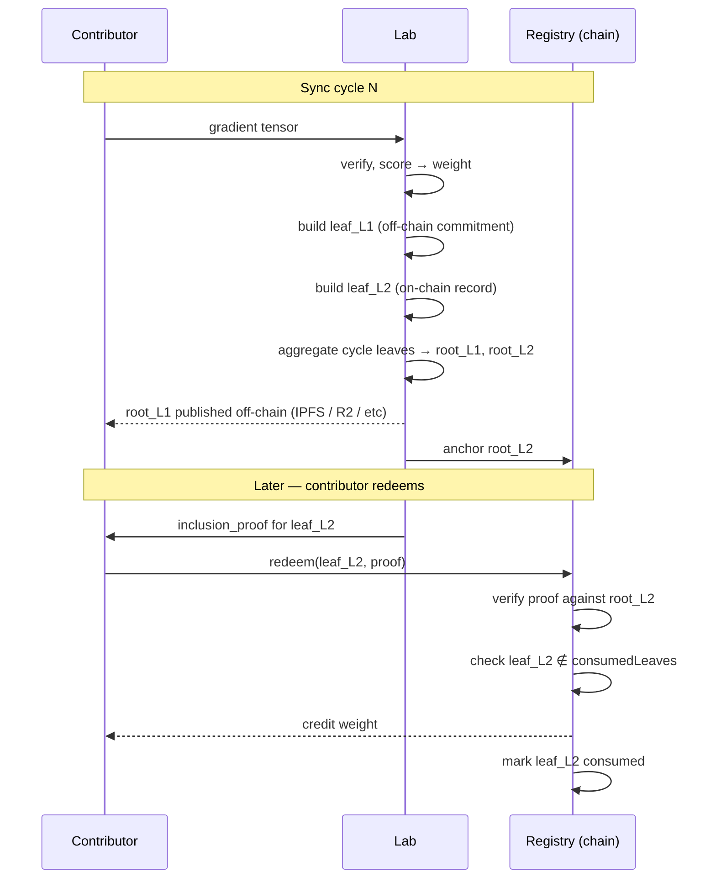
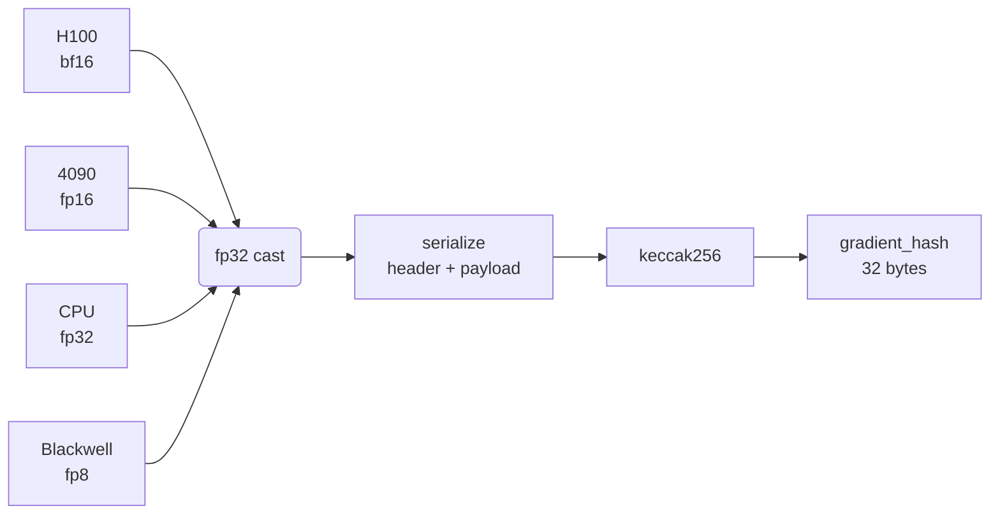

# TAS-1 Explainer: Cryptographic Attribution for Decentralized AI Training

> **Read this first if** you're an Ethereum researcher, smart-contract auditor,
> or AI-training engineer trying to understand TAS-1 without reading the full
> spec. This document is design rationale plus a worked example. The
> normative spec is at [`spec/v1.md`](../spec/v1.md).

---

## TL;DR

TAS-1 specifies the bytes on the wire for **crediting a contributor for a
specific gradient artifact in a specific training cycle of a decentralized
AI training run.** Four byte formats and a Merkle tree. The whole standard
is byte-equivalent across EVM, non-EVM, and zk-circuit implementations.
CC0 — fork it, brand it, productize it.

## The problem

Decentralized model training has produced its first credible empirical
result: Templar's Covenant-72B reached ~67 MMLU at fully permissionless
scale in March 2026. The compute side is solved.

The *attribution* side is not. Every project building in this space —
Templar, Macrocosmos IOTA, Pluralis, Gensyn, Kardashev — re-invents the
same four primitives:

1. A canonical gradient identity (some hash of some serialization).
2. A contributor-to-gradient binding leaf.
3. An on-chain attribution record.
4. Replay protection so the same leaf can't be credited twice.

Each implementation is incompatible with every other. An attribution
receipt from network A cannot be verified by tooling from network B. There
is no portable artifact that an academic paper, an inference-revenue
auditor, or a cross-network reputation system can reference.

TAS-1 is the smallest fix. It standardizes the four byte formats. It is
agnostic to *how* you produce the gradient, *how* you derive a contribution
weight from it, *how* you issue tokens, and *what chain* hosts the records.

## The actor model

Three actors per training run:

- **Lab** — the entity that runs the training. Aggregates gradients,
  scores them, and publishes commitments per cycle. The lab is the trust
  anchor of a TAS-1 v1 run; TAS-2+ extensions reduce or remove this trust.
- **Contributor** — anyone who submits work (gradients in v1; data and
  capital in v1.x). Identified by a 20-byte EVM address.
- **Registry** — an on-chain contract that anchors attribution roots and
  redeems inclusion proofs into credited weight.

Time is divided into **sync cycles**, each with a monotonically increasing
integer index. Two Merkle roots are produced per cycle.



The two-roots-per-cycle structure exists because the two roots answer
different questions and live in different places:

- **Layer 1 root** (off-chain) — *which gradients did the lab accept this
  cycle?* Lives wherever you want (IPFS, R2, a public S3 bucket); never
  touches the chain. Big set.
- **Layer 2 root** (on-chain) — *which contributors are owed weight this
  cycle?* Anchored on chain. Small set.

On-chain gas cost scales with the Layer 2 set, not the Layer 1 set.

## §4.1 — Hash the gradient

The gradient is a real-valued tensor of arbitrary rank and shape (typically
2-D weight deltas, but rank-1 bias updates and rank-0 scalars are also
gradients).

### The fp32 mandate

The hardest part of standardizing gradient hashes is that contributors
have different hardware. An H100 produces bf16. A 4090 produces fp16. A
CPU produces fp32. A Blackwell produces fp8. If each contributor hashes
in their native dtype, the same logical gradient produces different
hashes — and cross-contributor verification is impossible.



TAS-1 forces fp32 (IEEE 754 binary32) as the canonical form. Every modern
accelerator can produce it deterministically. The round-trip rounding
error from native compute → fp32 → hash is acceptable for content
addressing; future revisions (TAS-2) MAY relax this in favor of TEE-attested
or ZK-witness commitments to the original-precision tensor.

### The serialization

```
header  := u32_le(rank) || u32_le(dim_0) || u32_le(dim_1) || ... || u32_le(dim_{rank-1})
payload := tensor bytes, fp32 little-endian, C-contiguous (row-major)
serialized := header || payload
gradient_hash := keccak256(serialized)
```

### Worked example — TV-2

A length-4 vector of ones (`[1.0, 1.0, 1.0, 1.0]`):

```
shape:  [4]  → rank=1, dim_0=4
values: 1.0 in fp32 = 0x3f800000 (little-endian: 00 00 80 3f)

serialized = 01 00 00 00      // rank = 1
           | 04 00 00 00      // dim_0 = 4
           | 00 00 80 3f      // 1.0
           | 00 00 80 3f      // 1.0
           | 00 00 80 3f      // 1.0
           | 00 00 80 3f      // 1.0

gradient_hash = keccak256(serialized)
              = 9e2c41a06d1f73a897cb2a2c5e0b951595e556ad1c5e78f1f617ad7974ad923b
```

That is one of the conformance test vectors (`test-vectors/gradient-hash.json`,
TV-2). Any TAS-1 implementation that emits a different value for that
input is non-conforming.

## §4.2 — Layer 1 leaf (off-chain Lab Commitment)

A Layer 1 leaf binds a contributor address, a sync cycle, and a gradient
hash to a 32-byte digest. The lab builds one leaf per accepted gradient
in a cycle and Merkle-roots them all into the per-cycle Lab Commitment.

```
preimage = address(20 bytes, lowercase)
         | cycle(32 bytes, big-endian)
         | gradient_hash(32 bytes)

leaf_L1 = keccak256(preimage)
```

Total preimage length: **84 bytes**.

### Worked example — TV-4

```
contributor   = 0x000000000000000000000000000000000000beef
sync_cycle    = 1
gradient_hash = 55cad9c1b25f52dc5b538a030f9293d6b4725f4bb5c6f187edba688aa5a70780

preimage      = 00 00 00 00 00 00 00 00 00 00 00 00 00 00 00 00 00 00 be ef
              | 00 00 00 00 00 00 00 00 00 00 00 00 00 00 00 00
              | 00 00 00 00 00 00 00 00 00 00 00 00 00 00 00 01
              | 55 ca d9 c1 b2 5f 52 dc 5b 53 8a 03 0f 92 93 d6
              | b4 72 5f 4b b5 c6 f1 87 ed ba 68 8a a5 a7 07 80

leaf_L1       = 67eece34b229901a73bedd98cb46d1f77929156db0f66a8dc3429a50652c1f05
```

### Why three fields, no more

The Layer 1 leaf binds **the smallest tuple that proves a gradient was
submitted by a specific contributor in a specific cycle.** Adding more
fields (timestamps, metadata, run identifiers) is rejected:

- The run identifier is implicit. A Lab Commitment Root is published per
  `(runId, syncCycle)`, so the root's location already binds the run.
- Timestamps would be non-deterministic across contributors, preventing
  identical gradients from producing identical leaves.
- Metadata (model version, batch index) is the lab's responsibility to
  publish through other channels and does not need cryptographic binding
  under this standard.

### What Layer 1 proves — and doesn't

A Layer 1 inclusion proof for `(contributor, sync_cycle, gradient_hash)`
proves *the lab accepted gradient X from contributor Y in sync cycle C of
run R.* It does **not** prove:

- That the gradient improved the model
- That the gradient was honestly computed
- That the lab itself behaved honestly

These guarantees require TAS-2+ extensions (multi-validator quorum, fraud
proofs, ZK proofs of training).

## §4.3 — Layer 2 leaf (on-chain Contribution Record)

A Layer 2 leaf binds contributor, contribution weight, contribution type,
and sync cycle. The on-chain Registry consumes one Layer 2 leaf per
contributor-cycle pair.

```solidity
inner   = keccak256(abi.encode(
              address contributor,    // padded to 32 bytes
              uint256 weight,         // 32 bytes
              uint8   contributionType, // padded to 32 bytes
              uint256 syncCycle       // 32 bytes
          ))                          // 128-byte preimage
leaf_L2 = keccak256(bytes.concat(inner))   // double-hash
```

### Why double-keccak

Single-keccak Merkle leaves are vulnerable to a second-preimage attack at
the leaf/intermediate-node boundary. An attacker who can control 64 bytes
of input could forge a "leaf" that is bit-identical to an existing
intermediate node, and pass off the intermediate as a leaf in proofs.

OpenZeppelin's canonical leaf form wraps the leaf in a second `keccak256`
to prevent this. TAS-1 §4.3 follows that convention.

### Why not on Layer 1

Layer 1's preimage is 84 bytes. An intermediate Merkle node's preimage is
64 bytes (two concatenated 32-byte hashes). The lengths are structurally
incompatible — no Layer 1 preimage can be misread as an intermediate node
under the same hash function. The double-keccak is therefore unnecessary
on Layer 1, and the spec does not require it.

The asymmetry surprises some readers; it is documented in the spec
(§4.2.1) and remains an open question for ERC review (see the EM thread).

### Reserved contribution types

| Type | Meaning |
|------|---------|
| 0    | Compute |
| 1    | Data    |
| 2    | Capital |
| 3–255 | Implementation-defined |

v1.x extensions will use types 1 and 2 with additional leaf encodings.
Implementations MUST NOT reassign 0–2.

## §4.4 — Sort-pair Merkle

Pair-hash matches OpenZeppelin's `MerkleProof.commutativeKeccak256`:

```
hash_pair(a, b) := keccak256(min(a, b) || max(a, b))
```

Tree construction promotes odd nodes unchanged. Inclusion proofs are the
ordered sibling hashes encountered on the leaf-to-root walk.

```
                     root
                    /    \
                  /        \
                /            \
             p_01            p_2 (promoted)
            /    \
          /        \
        leaf_0    leaf_1     leaf_2
```

`p_01 = hash_pair(leaf_0, leaf_1)`, `root = hash_pair(p_01, leaf_2)`. To
prove `leaf_1` is in the tree, the proof is `[leaf_0, leaf_2]` — the
verifier reconstructs `hash_pair(leaf_1, leaf_0) = p_01`, then
`hash_pair(p_01, leaf_2) = root`, and compares to the published root.

### Why sort-pair

Two reasons. Smaller proofs (no left/right bit per level), and verifier
simplicity (one `hash_pair` function regardless of tree position). The
trade-off is that the proof loses the left/right ordering information,
but for set-membership Merkle trees that information is not load-bearing
— the leaves are unique by construction (per §4.5 replay protection).

## §4.5 — Replay protection

Any leaf consumed by a credit-issuing operation MUST be tracked and
refused on second presentation. The reference Solidity implementation
uses a `consumedLeaves: mapping(bytes32 => bool)`.

```solidity
function redeem(bytes32 leaf, bytes32[] calldata proof) external {
    require(MerkleProof.verify(proof, contributionRoot, leaf), "bad proof");
    require(!consumedLeaves[leaf], "already redeemed");
    consumedLeaves[leaf] = true;
    // ... credit weight, emit event
}
```

The leaf bytes are deterministic across `(contributor, weight, type, cycle)`,
so even if the same tuple appears in multiple roots — which it shouldn't,
but in adversarial settings might — the leaf is rejected on the second
presentation.

ZK-leaning implementations may prefer a nullifier-accumulator scheme. The
spec is normative on the *requirement* but silent on the *mechanism*; this
is one of the open questions for ERC review.

## End-to-end flow

The full lifecycle of a single attribution receipt:

```mermaid
sequenceDiagram
    autonumber
    participant Lab
    participant Contributor as Contributor (addr=0x...beef)
    participant Off as Off-chain storage
    participant Chain as Registry contract

    Note over Lab,Chain: Cycle N — gradient submission
    Contributor->>Lab: gradient tensor T (fp16, 4-vector)
    Lab->>Lab: cast → fp32, serialize, keccak256<br/>= gradient_hash
    Lab->>Lab: leaf_L1 = keccak256(addr || cycle || gradient_hash)
    Lab->>Lab: leaf_L2 = keccak256(keccak256(<br/>abi.encode(addr, weight=42, type=0, cycle=N)))

    Note over Lab,Chain: Cycle N — close
    Lab->>Off: publish root_L1 (Lab Commitment)
    Lab->>Chain: anchorContributionRoot(root_L2)

    Note over Lab,Chain: Later — contributor redeems
    Lab-->>Contributor: inclusion proof π for leaf_L2
    Contributor->>Chain: redeem(leaf_L2, π)
    Chain->>Chain: verify(π, root_L2, leaf_L2) ✓
    Chain->>Chain: assert leaf_L2 ∉ consumedLeaves ✓
    Chain->>Chain: credit weight=42 to addr=0x...beef
    Chain->>Chain: consumedLeaves[leaf_L2] = true
    Chain-->>Contributor: receipt
```

That is the whole protocol surface. Everything else — gradient quality
scoring, weight derivation, token issuance, inference-revenue routing —
is the implementing protocol's concern. TAS-1 is the byte format that
makes those concerns interoperable.

## Conformance Levels

- **Level A — Basic Attribution.** Implements §4.1–§4.5 byte-for-byte.
  Off-chain integrity (signed commits, TEE attestation, etc.) is the
  implementer's choice.
- **Level B — Signed Attribution.** Level A plus EIP-191 contributor
  signatures REQUIRED at the aggregator boundary. Recommended for new
  implementations.

A claim of "TAS-1 Level A" means: byte-for-byte conformance to the four
formats above, validated by the conformance suite. Anyone can claim it;
anyone can check it.

## What TAS-1 deliberately does not do

- **Validate gradient honesty.** A contributor can submit a malicious
  gradient that passes the lab's quality check; TAS-1 will still credit
  them. Defense against this is TAS-2 (multi-validator quorum) or TAS-3
  (TAO-style optimistic fraud proofs).
- **Validate lab honesty.** The lab is the trust anchor in v1. If the lab
  publishes a Lab Commitment that omits a contributor's gradient, TAS-1
  has no recourse. Defense is TAS-2+ economic mechanisms (lab stake,
  community challenges) or TAS-4 (ZK proofs of training).
- **Define contribution weight.** How `weight` is derived from a gradient
  is the implementing protocol's choice. Loss-delta scoring, validator
  quorum, ZK-proven training — TAS-1 doesn't care, as long as the weight
  the lab signs over and the weight in the Layer 2 leaf are the same
  integer.
- **Define monetization.** Token issuance, inference-revenue split,
  pure-credit reputation systems — all built on top, none specified here.

## Status and roadmap

- **TAS-1 v0.1** — published 2026-05-06 under CC0. This document.
- **TAS-1.x** — minor extensions for data attribution (type=1) and
  capital attribution (type=2). Same primitives, two new leaf encodings.
  Will ship when a real data or capital partner needs them.
- **TAS-2** — multi-validator quorum (Templar parity).
- **TAS-3** — TAO-style optimistic fraud proofs.
- **TAS-4** — ZK audit checkpoints (Kaizen / zkLoRA-style).

The numbering is deliberate — each higher number reduces the trust placed
in the lab, at the cost of additional protocol complexity.

## Get involved

- **Read the spec** — [`spec/v1.md`](../spec/v1.md). 900 lines.
- **Run the conformance suite** — `python conformance/run.py`. 17/17 should
  pass against the reference implementation.
- **Implement against the test vectors** — [`test-vectors/`](../test-vectors/).
  The fastest way to find spec ambiguities is to write a second implementation
  in another language and check it against the same JSON vectors.
- **Discuss design choices** — the Ethereum Magicians thread (link forthcoming
  once posted) is the primary discussion forum ahead of ERC submission.
- **File issues** — [github.com/tbmoss3/tas-1/issues](https://github.com/tbmoss3/tas-1/issues).
  Spec ambiguities, implementation bugs, conformance vector edge cases.

## License

CC0 1.0 Universal — public domain dedication. Use it, fork it, brand it,
productize it. Attribution is appreciated but not required.
